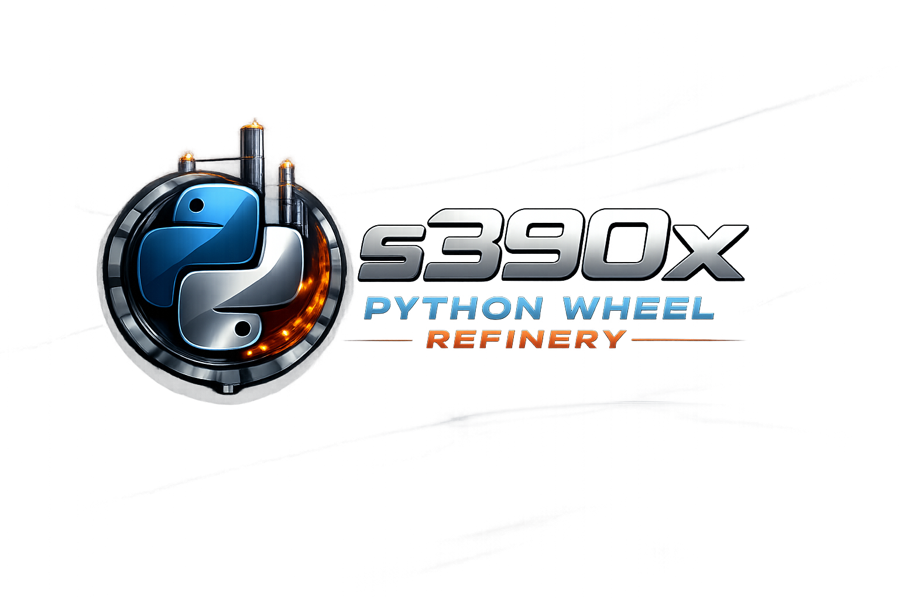

# s390x Wheel Refinery

<p align="center">
  
</p>


Refinery plans and executes reproducible s390x Python wheel builds. Feed it wheels **or a `requirements.txt`**, and it resolves pins, builds what is missing, repairs wheels, and publishes everything to content-addressed storage with full provenance, metrics, and UI visibility.

---

## Table of contents
- [Overview](#overview)
- [End-to-end flow](#end-to-end-flow)
- [System components](#system-components)
- [Artifacts, CAS, and storage](#artifacts-cas-and-storage)
- [Recipes, packs, and runtimes](#recipes-packs-and-runtimes)
- [Builder image](#builder-image)
- [Control-plane and UI](#control-plane-and-ui)
- [Worker and queue](#worker-and-queue)
- [Requirements.txt and job shape](#requirementstxt-and-job-shape)
- [Running locally](#running-locally)
- [Configuration reference](#configuration-reference)
- [Repair and compliance](#repair-and-compliance)
- [Development and testing](#development-and-testing)
- [Docs and diagrams](#docs-and-diagrams)
- [Status and known gaps](#status-and-known-gaps)
- [License](#license)
- [Glossary](#glossary)

---

## Overview
- **Planner (Go)** turns uploaded wheels or a `requirements.txt` (stored in object storage) into a DAG: runtimes → packs → wheels → repair. It checks CAS (Zot) to mark nodes as `reuse` vs `build`.
- **Worker (Go)** drains the queue, fetches/mounts artifacts, runs builds inside a dedicated builder image via Podman, and uploads wheels/repairs back to CAS and object storage.
- **Builder image** (`containers/refinery-builder/Containerfile`) carries toolchains, auditwheel/patchelf, and a recipe book for packs and CPython runtimes.
- **Artifact stores**: Zot (CAS) for digested blobs; MinIO (optional) for a wheelhouse mirror.
- **Observability**: metrics, events, manifest, control-plane API, and React UI showing artifacts, queue controls, and history.
- **Safety**: content-addressed everything, explicit dependency edges for packs/runtimes, and default auditwheel repair to enforce policy tags.

## End-to-end flow
1. **Plan**: Planner resolves requirements, computes wheels to build, and emits a DAG with pack/runtime dependencies. CAS hits are marked as `reuse`; misses become build nodes.
2. **Queue**: Control-plane enqueues build work (file/Redis/Kafka). UI shows queue depth and can trigger a worker run.
3. **Fetch/mount**: Worker topologically sorts DAG pack/runtime nodes, downloads needed artifacts from CAS, extracts them, and mounts them into the builder container (`DEPS_PREFIXES` wiring).
4. **Build**: Default runner inside the builder image builds each wheel with the requested Python version/tag and mounted packs.
5. **Repair**: `recipes/repair.sh` runs auditwheel to emit `<name>-<version>-repair.whl` with the correct manylinux policy tag.
6. **Publish**: Worker uploads packs/runtimes (when built), wheels, and repairs to CAS; mirrors wheels/repairs to MinIO when configured; emits manifest/events/metrics to the control-plane.

## System components
- **Go control-plane**: APIs for manifests, logs, queue, metrics, artifact metadata, and worker triggers (`containers/go-control-plane/Containerfile`).
- **Go worker**: Podman-only runner plus CAS/object-store client, executes build/repair steps (`containers/go-worker/Containerfile`). Worker image embeds podman.
- **Builder image**: `refinery-builder:latest` built from `containers/refinery-builder/Containerfile`; houses recipes and toolchains.
- **UI (React)**: dashboards for queue, artifacts, metrics, events, and log viewing (`containers/ui/Containerfile`).
- **External services**: Postgres, Redis (or Kafka) for queue/history; Zot for CAS; MinIO for wheelhouse object storage.

## Artifacts, CAS, and storage
- **CAS (Zot)** stores packs, runtimes, wheels, and repair outputs under digests. Keys include name/version/policy and the recipe digest.
- **Object storage (MinIO optional)** mirrors wheel/repair artifacts for easy download.
- **Manifests** describe every build with digests, timing, logs, and repair metadata; the control-plane stores and serves them.
- **Local cache** can be used for CAS fallbacks; set `LOCAL_CAS_DIR` in the worker to avoid refetching unchanged blobs.

## Recipes, packs, and runtimes
- Location: `recipes/` with pinned sources and SHA256s in `recipes/versions.sh`.
- Coverage: core crypto/ffi/compression (openssl, libffi, zlib, xz, bzip2, zstd), DB/XML (sqlite, libxml2, libxslt), imaging (jpeg, libpng, freetype), math (openblas), build tools (pkgconf, cmake, ninja, rust), and CPython runtimes (3.10/3.11/3.12).
- Contract: recipes expect `PACK_OUTPUT` (empty dir), install into `${PACK_OUTPUT}/usr/local` by default, and honor `DEPS_PREFIXES` for dependency prefixes. Each emits `manifest.json` with name/version/policy/recipe digest/deps.
- Use: the worker mounts dependencies, sets `DEPS_PREFIXES`, runs the recipe, tars `PACK_OUTPUT`, and pushes the blob to CAS.

## Builder image
- Built from `containers/refinery-builder/Containerfile`; includes build essentials, auditwheel, patchelf, and the recipe book at `/app/recipes`.
- Defaults injected into the worker: `CONTAINER_IMAGE=refinery-builder:latest`, `PACK_RECIPES_DIR=/app/recipes`, `DEFAULT_RUNTIME_CMD=/app/recipes/cpython311.sh`, `DEFAULT_REPAIR_CMD=/app/recipes/repair.sh`.
- Build it locally: `podman build -f containers/refinery-builder/Containerfile -t refinery-builder:latest .` (or `docker build` if needed).

## Control-plane and UI
- API on `:8080` (compose wiring): manifests, artifacts, metrics (`/metrics` Prometheus), queue ops, logs, and worker trigger.
- UI on `:3000` (compose wiring): artifacts with digests/URLs, queue depth, metrics panels, and log viewers.
- Auth: optional `WORKER_TOKEN` protects queue/trigger endpoints; UI can set it via `POST /api/session/token?token=...`.

## Worker and queue
- Queue backends: `file`, `redis`, or `kafka` (compose defaults to Redis).
- Worker mounts `/output` and `/cache`, drains the build queue, and runs Podman with the builder image (Podman-only). Inputs are read from object storage and metadata in Postgres; no shared `/input` volume is required. `PODMAN_BIN` defaults to whatever is on `PATH` and errors if absent. Default build command now wheels `JOB_NAME[/==JOB_VERSION]` via pip inside the builder image using any mounted runtime/packs. Worker container is privileged to allow nested podman.
- DAG ordering: worker topologically sorts pack/runtime nodes from the planner DAG to guarantee dependency order before wheel builds.
- Reuse vs build: CAS hits are reused; misses trigger pack/runtime builds and uploads unless the artifact is manifest-only.

## Requirements.txt and job shape
- Inputs are uploaded via the UI/API as immutable objects (wheel files or `requirements.txt`) and stored in object storage.
- Planner resolves requirements (honors constraints), computes wheel targets, and pins a Python tag from the requested version. Unpinned specs are resolved against configured indexes.
- Job metadata includes `python_tag`, `abi_tag`, `platform_tag`, requested packs, and repair policy. Defaults map Python version → manylinux2014_s390x.

## Running locally
- **Prereqs**: Podman, git, Go toolchain, Node/npm for UI dev.
- **Bring up the stack** (Zot + MinIO + Postgres + Redis/Kafka + control-plane + worker + UI):
  ```bash
  podman compose -f podman-compose.yml up
  ```
  Builds the control-plane, worker, and UI images; uses Zot for CAS and MinIO for wheelhouse.
- **Builder image**: build once locally (`refinery-builder:latest`) before running real workers:
  ```bash
  podman build -f containers/refinery-builder/Containerfile -t refinery-builder:latest .
  ```
- **Data dirs**: outputs appear in `./output`, cache/logs in `./cache`. Inputs are uploaded to object storage (MinIO) instead of a local `/input` folder.

## Configuration reference
- **Control-plane**: `HTTP_ADDR`, `POSTGRES_DSN`, `QUEUE_BACKEND`, `REDIS_URL`, `KAFKA_BROKERS`, `WORKER_WEBHOOK_URL`, `WORKER_PLAN_URL`, `WORKER_TOKEN`, `CAS_REGISTRY_URL`, `CAS_REGISTRY_REPO`, `OBJECT_STORE_*`.
- **Worker**: `OUTPUT_DIR`, `CACHE_DIR`, `PYTHON_VERSION`, `PLATFORM_TAG`, `QUEUE_BACKEND`, `REDIS_URL`, `KAFKA_BROKERS`, `PODMAN_BIN`, `CONTAINER_IMAGE`, `WORKER_RUN_CMD` (override container entrypoint), `PACK_RECIPES_DIR`, `DEFAULT_RUNTIME_CMD`, `DEFAULT_REPAIR_CMD`, `CAS_REGISTRY_URL/REPO`, `LOCAL_CAS_DIR`, `OBJECT_STORE_*`.
- **Repair metadata**: `REPAIR_POLICY_HASH`, `REPAIR_TOOL_VERSION` are attached to repair artifacts for provenance.

## Repair and compliance
- `recipes/repair.sh` runs auditwheel repair by default; installs auditwheel if missing in the builder image and fails when no repaired wheel is produced.
- Output naming: `<name>-<version>-repair.whl` with policy tag (manylinux2014_s390x by default).
- Policy and tool info are stored alongside the artifact so downstream consumers can verify provenance.

## Development and testing
- **Go**:
  ```bash
  cd go-worker && go test ./...
  cd go-control-plane && go test ./...
  ```
- **UI**:
  ```bash
  cd ui
  npm install
  npm test
  # npm run dev (with VITE_API_BASE=http://localhost:8080) for local UI
  ```
- **Recipes**: smoke a pack locally:
  ```bash
  ZLIB_OUT="$(mktemp -d)"
  PACK_OUTPUT="$ZLIB_OUT" SOURCES_DIR="$PWD/.sources" ./recipes/zlib.sh
  ```

## Docs and diagrams
- Architecture snapshot: `docs/overview.md`.
- System diagram (Mermaid): `docs/diagrams/overall-system.mmd`.
- Builder image details: `containers/refinery-builder/Containerfile`.

## Status and known gaps
- Pack dependency metadata is currently hardcoded in the planner; promoting this to a catalog is planned.
- Ensure real pack/runtime recipes are built and pushed in environments beyond local smoke (builder image must be built/published where workers run).
- Continue to refine repair/policy metadata and catalog-driven pack selection as recipes expand.

## License
- Licensed under the GNU Affero General Public License v3.0. See `LICENSE`.

## Glossary
- **CAS**: Content-addressable storage; stores blobs by digest. We use Zot as the CAS registry. https://project-zot.github.io/docs/
- **Zot**: OCI registry used here as CAS for packs/runtimes/wheels/repairs. https://github.com/project-zot/zot
- **MinIO**: S3-compatible object store used to mirror wheels/repairs for download. https://min.io
- **Auditwheel**: Tool to check/repair wheels to comply with manylinux policy tags; default repair step uses it. https://github.com/pypa/auditwheel
- **Podman**: Container engine used by the worker runner; defaults to the binary on PATH. https://podman.io
- **Manylinux2014**: Baseline glibc/musl compatibility policy for Linux wheels; s390x is supported. https://peps.python.org/pep-0599/
- **Pack**: A bundle of native deps (libs/headers/pkg-config) built from a recipe into a prefix (e.g., /opt/packs/<digest>/usr/local).
- **Runtime**: A built CPython interpreter + stdlib/headers produced by runtime recipes; mounted into builds.
- **DEPS_PREFIXES**: Colon-separated list of mounted pack prefixes passed to recipes so they can find headers/libs.
- **Repair wheel**: The post-processed wheel emitted by `recipes/repair.sh`, named `<name>-<version>-repair.whl` with policy tag metadata.
- **Builder image**: `refinery-builder:latest` containing toolchains, auditwheel/patchelf, and recipes at `/app/recipes`.
- **Control-plane**: Go service exposing API/metrics/queue/logs and persisting manifests/events.
- **Worker**: Go service that drains the queue, fetches CAS artifacts, mounts packs/runtimes, and runs builds via Podman in the builder image.
- **DAG**: Directed acyclic graph emitted by the planner describing dependencies between runtimes, packs, wheels, and repair steps.
